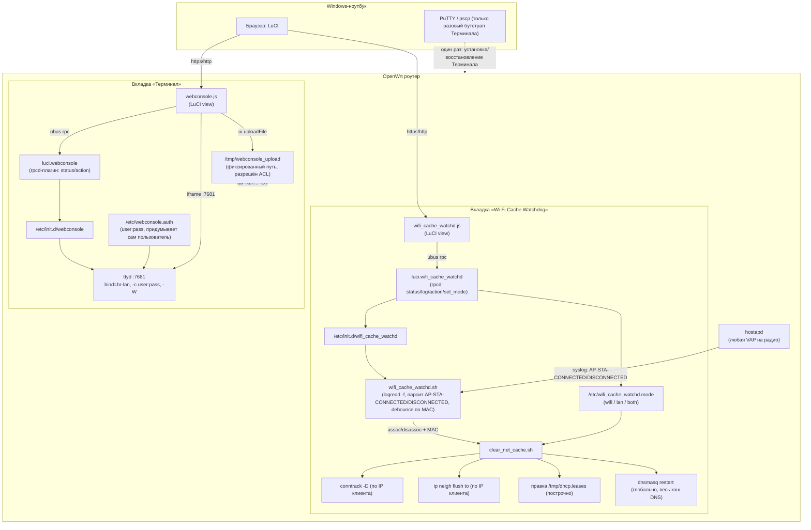

# OpenWrt Router Toolkit — карта проекта

Технический обзор проекта, независимый от конкретного ИИ-инструмента —
этого документа достаточно, чтобы понять архитектуру, найти любой файл и
повторить установку/обновление с нуля, без доступа к истории переписки.

Целевые устройства: OpenWrt 24.10.3 (GL.iNet GL-MT3000, GL-XE3000, а также
Cudy TR3000 128MB — совместимое железо). Роутер используется как
лабораторный стенд.

Репозиторий: **https://github.com/Noahbenlameh/openwrt-router-toolkit**
(публичный, ветка `master`).

Автор: [Noahbenlameh](https://github.com/Noahbenlameh).

---

## 0. Самый быстрый способ поставить обе вкладки сразу

На роутере (нужен любой шелл — PuTTY при первой установке, или уже
работающий «Терминал» при обновлении):
```sh
wget -O install.sh https://raw.githubusercontent.com/Noahbenlameh/openwrt-router-toolkit/master/install.sh
sh install.sh
```
`install.sh` сам скачивает архив репозитория, раскладывает файлы обеих
вкладок по путям, ставит `ttyd`/`conntrack`/`ip-full`, один раз спрашивает
пароль для терминала (если ещё не задан — `read`, поэтому именно два шага,
а не `wget ... | sh`, иначе запрос пароля не сработает), включает автозапуск
и дописывает всё в `/etc/sysupgrade.conf`. Идемпотентен — безопасно
перезапускать повторно для обновлений.

Ручные пошаговые способы (разбор по вкладкам, для отладки/понимания) — в
разделе 4 ниже и в `QUICKSTART.md`.

---

## 1. Что это — два независимых компонента LuCI

| Вкладка | Где в LuCI | Папка | Архив | Назначение |
|---|---|---|---|---|
| **Терминал** | System → Терминал | `tab2-terminal/` | `webconsole.tar.gz` | Полноценный root-shell в браузере (движок `ttyd`) + кнопка загрузки файлов на роутер. Заменяет PuTTY для повседневной работы. |
| **Wi-Fi Cache Watchdog** | Status → Wi-Fi Cache Watchdog | `tab1-cache-watchdog/` | `wifi_cache_watchd.tar.gz` | При каждом подключении/отключении клиента к любой из Wi-Fi точек (VAP) чистит его временное сетевое состояние на роутере: conntrack, ARP/ND, DHCP-лизу. |

Компоненты **намеренно полностью независимы** — отдельные папки, отдельные
архивы, отдельные ubus-объекты и ACL. Любой можно установить или удалить,
не затрагивая другой.

Порядок установки важен: **сначала «Терминал»** (единственный раз через
PuTTY), **затем всё остальное — уже через сам «Терминал»**, без PuTTY.

---

## 2. Архитектура



---

## 3. Файловая карта

### `tab1-cache-watchdog/` — Wi-Fi Cache Watchdog

| Файл в папке | Путь на роутере | Роль |
|---|---|---|
| `clear_net_cache.sh` | `/usr/bin/clear_net_cache.sh` | Сама логика очистки: conntrack/ARP-ND/DHCP-лиза по конкретному клиенту, DNS-кэш глобально, опционально `drop_caches`. Режим (`wifi`/`lan`/`both`) читает из `/etc/wifi_cache_watchd.mode`. |
| `wifi_cache_watchd.sh` | `/usr/sbin/wifi_cache_watchd.sh` | Демон: `logread -f`, парсит строки hostapd `AP-STA-CONNECTED`/`AP-STA-DISCONNECTED` (не ubus — см. «Грабли», п.9) + MAC клиента, дебаунс по MAC (1 сек, схлопывает быстрые переподключения), вызывает `clear_net_cache.sh`. Также пишет/чистит `/tmp/.wcw_connected/<mac>` (timestamp коннекта) для расчёта аптайма в списке клиентов. |
| `wifi_cache_watchd.init` | `/etc/init.d/wifi_cache_watchd` | procd-автозапуск демона. |
| `luci.wifi_cache_watchd` | `/usr/libexec/rpcd/luci.wifi_cache_watchd` | rpcd-плагин, ubus-объект `luci.wifi_cache_watchd`: `status`, `log`, `action` (start/stop/enable/disable), `set_mode`, `clients` — полный список Wi-Fi+LAN клиентов, всё пассивно (без обращения к самому устройству): MAC/IP/hostname/аптайм/лиза, для Wi-Fi ещё канал/частота/SSID (`iwinfo info`), PHY-детали rx/tx (MCS/ширина канала/SGI/потоки, из `iwinfo assoclist`), 802.11-возможности устройства (HT/VHT/HE/WMM/MFP, best-effort из `hostapd.<iface> get_clients`), число и список активных соединений (`conntrack -L -s <ip>`). LAN — классификация через `bridge fdb` + `dhcp.leases`. |
| `luci-app-wifi-cache-watchd.acl.json` | `/usr/share/rpcd/acl.d/luci-app-wifi-cache-watchd.json` | ACL для ubus-методов выше. |
| `luci-app-wifi-cache-watchd.menu.json` | `/usr/share/luci/menu.d/luci-app-wifi-cache-watchd.json` | Пункт меню `Status → Wi-Fi Cache Watchdog`. |
| `wifi_cache_watchd.js` | `/www/luci-static/resources/view/wifi_cache_watchd.js` | Страница LuCI: пояснение (RU), статус/автозапуск, переключатель режима, таблица живых счётчиков, список подключённых устройств с раскрывающимися по клику строками (полные характеристики: сигнал/шум, rx/tx rate, аптайм, лиза), live-лог. |
| `build_release.sh` | — (только на компьютере разработки) | Собирает всё выше в `wifi_cache_watchd.tar.gz` с путями роутера внутри архива. |
| `INSTALL.md` | — | Инструкция для этой вкладки отдельно (короткая, только команды). |

### `tab2-terminal/` — Терминал

| Файл в папке | Путь на роутере | Роль |
|---|---|---|
| `webconsole.init` | `/etc/init.d/webconsole` | procd-автозапуск `ttyd` (bind `br-lan:7681`, `-c user:pass` из auth-файла, `-W` — разрешить ввод). Отказывается стартовать, если auth-файла нет. |
| `luci.webconsole` | `/usr/libexec/rpcd/luci.webconsole` | rpcd-плагин, ubus-объект `luci.webconsole`: `status`, `action`. |
| `luci-app-webconsole.acl.json` | `/usr/share/rpcd/acl.d/luci-app-webconsole.json` | ACL для ubus-методов + отдельное разрешение записи файла по пути `/tmp/webconsole_upload` (без этого явного разрешения LuCI блокирует загрузку файла ошибкой ACL). |
| `luci-app-webconsole.menu.json` | `/usr/share/luci/menu.d/luci-app-webconsole.json` | Пункт меню `System → Терминал`. |
| `webconsole.js` | `/www/luci-static/resources/view/webconsole.js` | Страница LuCI: статус/автозапуск, кнопка загрузки файла (всегда в `/tmp/webconsole_upload`), `<iframe>` с самим терминалом ttyd. |
| `build_release.sh` | — | Собирает всё выше в `webconsole.tar.gz`. |
| `INSTALL.md` | — | Инструкция для этой вкладки отдельно. |

### Корень проекта

| Файл | Роль |
|---|---|
| `install.sh` | Единый установщик для роутера (см. раздел 0) — тянет архив репозитория с GitHub и ставит обе вкладки одной парой команд. |
| `QUICKSTART.md` | Быстрый последовательный гайд: установка Терминала → установка Cache Watchdog через Терминал → раздел «дальнейшие обновления» → удаление. Только команды, минимум прозы. |
| `PROJECT_MAP.md` | Этот файл — общая карта + подробная инструкция + грабли. |
| `.gitignore` | Исключает `.DS_Store` и собранные `*.tar.gz` (пересобираются `build_release.sh`, в git не нужны). |

Файлы на роутере, которые появляются **не из архивов**, а создаются вручную
в процессе установки:
- `/etc/webconsole.auth` — `user:pass` для входа в терминал (придумывает и
  вводит пользователь сам, никогда не передаётся между машинами/в чат).
- `/etc/wifi_cache_watchd.mode` — создаётся автоматически при первом
  переключении режима на странице (по умолчанию, если файла нет — `wifi`).
- Записи в `/etc/sysupgrade.conf` — оба install-флоу дописывают туда свои
  пути, чтобы пережить `sysupgrade` (не обычную перезагрузку — та и так не
  трогает файлы вне `/etc/config/*`).

---

## 4. Подробная инструкция по установке и обновлению

### 4.1. Установка «Терминала» (один раз, через PuTTY)

PowerShell на Windows (путь к PuTTY может отличаться — открой ту папку, где
реально лежит `pscp.exe`):
```powershell
cd "C:\Program Files\PuTTY"
.\pscp.exe -scp C:\путь\к\webconsole.tar.gz root@<router-ip>:/tmp/
```
Флаг `-scp` обязателен (см. «Грабли» ниже). Host key в первый раз — `y`.
Пароль — root от роутера.

PuTTY, SSH-сессия (root@<router-ip>), команды по одной строке:
```sh
cd /tmp
tar -xzf webconsole.tar.gz -C /
rm webconsole.tar.gz
opkg update
opkg install ttyd
chmod +x /etc/init.d/webconsole /usr/libexec/rpcd/luci.webconsole
```

Свой пароль для терминала — придумывается и вводится прямо здесь, никуда не
пересылается:
```sh
printf 'root:ЗАМЕНИ_НА_СВОЙ_ПАРОЛЬ\n' > /etc/webconsole.auth
chmod 600 /etc/webconsole.auth
```

```sh
/etc/init.d/webconsole enable
/etc/init.d/webconsole start
/etc/init.d/rpcd restart
rm -f /tmp/luci-indexcache*
```

Регистрация путей для переживания `sysupgrade`:
```sh
grep -qxF /etc/webconsole.auth /etc/sysupgrade.conf 2>/dev/null || echo /etc/webconsole.auth >> /etc/sysupgrade.conf
```
```sh
for f in /etc/init.d/webconsole /usr/libexec/rpcd/luci.webconsole /usr/share/rpcd/acl.d/luci-app-webconsole.json /usr/share/luci/menu.d/luci-app-webconsole.json /www/luci-static/resources/view/webconsole.js; do grep -qxF "$f" /etc/sysupgrade.conf 2>/dev/null || echo "$f" >> /etc/sysupgrade.conf; done
```

**Проверка:** `http://<router-ip>` → **System → Терминал** →
`running` / `autostart: on` / `password: set`. Терминал внизу страницы
попросит логин отдельным окном — пароль из `/etc/webconsole.auth`, не
LuCI-пароль. Если LuCI на **https** — один раз открой отдельной вкладкой
`http://<router-ip>:7681/` и прими предупреждение сертификата, иначе
`<iframe>` терминала не загрузится (mixed content).

### 4.2. Установка «Wi-Fi Cache Watchdog» (через уже установленный Терминал)

1. Сохрани присланный `wifi_cache_watchd.tar.gz` на Windows.
2. LuCI → **System → Терминал** → **Upload file / archive** → выбрать файл
   → **Upload to router**. Всегда ложится под одним и тем же именем —
   `/tmp/webconsole_upload`.
3. В окне терминала — команды **по одной строке за раз** (см. «Грабли» про
   разрыв длинной вставки):
```sh
tar -xzf /tmp/webconsole_upload -C /
```
```sh
rm /tmp/webconsole_upload
```
```sh
opkg update
```
```sh
opkg install conntrack ip-full
```
```sh
/etc/init.d/wifi_cache_watchd enable
```
```sh
for f in /usr/bin/clear_net_cache.sh /usr/sbin/wifi_cache_watchd.sh /etc/init.d/wifi_cache_watchd /usr/libexec/rpcd/luci.wifi_cache_watchd /usr/share/rpcd/acl.d/luci-app-wifi-cache-watchd.json /usr/share/luci/menu.d/luci-app-wifi-cache-watchd.json /www/luci-static/resources/view/wifi_cache_watchd.js /etc/wifi_cache_watchd.mode; do grep -qxF "$f" /etc/sysupgrade.conf 2>/dev/null || echo "$f" >> /etc/sysupgrade.conf; done
```
```sh
/etc/init.d/wifi_cache_watchd restart
```
```sh
/etc/init.d/rpcd restart
```
```sh
rm -f /tmp/luci-indexcache*
```

**Проверка:** `http://<router-ip>` → **Status → Wi-Fi Cache Watchdog** →
`running` / `autostart: on`. Живой лог:
```sh
logread -f | grep wifi_cache_watchd
```

### 4.3. Дальнейшие обновления (любой вкладки, включая будущие)

Всегда одинаково, через страницу «Терминал», без PuTTY: Upload file/archive
→ выбрать новый `.tar.gz` → Upload to router → в терминале, по одной
строке:
```sh
tar -xzf /tmp/webconsole_upload -C /
```
```sh
rm /tmp/webconsole_upload
```
```sh
/etc/init.d/<нужный-сервис> restart
```
```sh
/etc/init.d/rpcd restart
```
```sh
rm -f /tmp/luci-indexcache*
```
`<нужный-сервис>` — `wifi_cache_watchd` или `webconsole` (или имя будущей
вкладки). После — F5 в браузере.

### 4.4. Удаление

**Wi-Fi Cache Watchdog:**
```sh
/etc/init.d/wifi_cache_watchd stop
/etc/init.d/wifi_cache_watchd disable
rm -f /usr/bin/clear_net_cache.sh /usr/sbin/wifi_cache_watchd.sh /etc/init.d/wifi_cache_watchd /usr/libexec/rpcd/luci.wifi_cache_watchd /usr/share/rpcd/acl.d/luci-app-wifi-cache-watchd.json /usr/share/luci/menu.d/luci-app-wifi-cache-watchd.json /www/luci-static/resources/view/wifi_cache_watchd.js /etc/wifi_cache_watchd.mode
/etc/init.d/rpcd restart
rm -f /tmp/luci-indexcache*
```

**Терминал** (делать через PuTTY, а не через саму вкладку — логично, раз
убираешь инструмент, которым только что пользовался):
```sh
/etc/init.d/webconsole stop
/etc/init.d/webconsole disable
rm -f /etc/init.d/webconsole /usr/libexec/rpcd/luci.webconsole /usr/share/rpcd/acl.d/luci-app-webconsole.json /usr/share/luci/menu.d/luci-app-webconsole.json /www/luci-static/resources/view/webconsole.js /etc/webconsole.auth
opkg remove ttyd
/etc/init.d/rpcd restart
rm -f /tmp/luci-indexcache*
```

В обоих случаях пути из `/etc/sysupgrade.conf` удали вручную, если нужно
(`vi /etc/sysupgrade.conf`).

---

## 5. Грабли — почему сделано именно так

Все пункты ниже — реальные ошибки, пойманные и исправленные в процессе
установки на этом же роутере. Не наступай снова.

1. **`pscp` требует флаг `-scp`.** По умолчанию `pscp` пробует протокол
   SFTP; на OpenWrt (dropbear) обычно нет `sftp-server` → ошибка
   `ash: /usr/libexec/sftp-server: not found` и обрыв соединения. Флаг
   `-scp` форсирует старый протокол SCP, который dropbear поддерживает
   всегда.
2. **Загрузка файла через LuCI (`ui.uploadFile`) требует точного пути в
   ACL.** Встроенный в LuCI загрузчик (`cgi-io`) проверяет ACL по точному
   пути назначения, wildcard/маска ненадёжны. Поэтому путь загрузки —
   всегда фиксированный `/tmp/webconsole_upload`, явно прописанный в
   `luci-app-webconsole.acl.json` (`"file": {"/tmp/webconsole_upload": ["write"]}`),
   а не собирается динамически из имени файла.
3. **Пакет называется `conntrack`, не `conntrack-tools`.** Последнее —
   имя апстрим-проекта (conntrack-tools.netfilter.org); в feed'е OpenWrt
   бинарник `conntrack` ставится пакетом `conntrack`.
4. **`ttyd` по умолчанию read-only.** Без флага `-W` терминал в браузере
   показывает вывод, но не принимает ввод с клавиатуры.
5. **Длинные команды с `&&`, вставленные в браузерный терминал (ttyd),
   иногда рвутся посередине строки** — часть команды может выполниться
   как отдельная, не связанная команда (наблюдалось: `rm` без аргумента
   → вывод справки busybox, а вторая половина строки пыталась запуститься
   как отдельная программа → `Permission denied`). Поэтому в командах для
   вставки в этот терминал — одна команда на строку, без `&&`.
6. **`/tmp` на OpenWrt — это tmpfs (RAM), не флеш.** Даже если забыть `rm`
   после распаковки архива, ничего не накапливается на постоянной памяти;
   всё пропадает само при перезагрузке. `rm`/`&&` — про гигиену и
   предсказуемость (не занимать RAM, не путать одноимённые файлы), а не
   про экономию флеш-места.
7. **Ограничение «не трогать конфигурацию» — это конкретно `/etc/config/*`
   (wireless/network/firewall/dhcp через UCI), а не весь `/etc`.** Файлы
   вроде `/etc/sysupgrade.conf`, `/etc/wifi_cache_watchd.mode`,
   `/etc/webconsole.auth` — не UCI-конфиг роутера, их создавать и менять
   можно свободно.
8. **`sysupgrade` (обновление прошивки) по умолчанию стирает всё, что не
   перечислено в `/etc/sysupgrade.conf`** — включая `/usr/*`,
   `/etc/init.d/*` и т.п. (в отличие от обычной перезагрузки, которая эти
   файлы не трогает). Оба install-флоу сами дописывают туда свои пути;
   бинарные opkg-пакеты (`ttyd`, `conntrack`, `ip-full`) этим способом не
   сохраняются — после реальной прошивки их придётся ставить заново.
9. **`ubus listen 'hostapd.*'` — НЕ гарантированный источник assoc/disassoc
   событий.** Изначальная версия демона была на нём построена и полностью
   молчала на реальном роутере (объект `hostapd.<iface>` в ubus существует,
   но никаких notify-событий не публикуется) — подтверждено эмпирически на
   `wpad-basic-mbedtls` (OpenWrt 24.10.3): `ubus listen` без фильтра, во
   время реального подключения/отключения клиента, дал абсолютно пустой
   вывод, хотя `hostapd` в это же время исправно писал в syslog
   `AP-STA-CONNECTED`/`AP-STA-DISCONNECTED` с MAC-адресом. Сейчас демон
   читает именно syslog (`logread -f`), а не ubus — это работает независимо
   от того, какая сборка hostapd/wpad стоит, и это не костыль под один
   роутер, а более портируемый способ в принципе. Если в будущем снова
   возникнет соблазн вернуться на ubus — сначала проверь
   `ubus listen` (без фильтра!) во время реального события, вживую, прежде
   чем на это полагаться.
10. **При диагностике `ps` может ввести в заблуждение по количеству
    процессов.** `команда1 | while read ...; done` в ash — это конвейер:
    правая часть создаёт дочерний subshell форком БЕЗ exec, поэтому в `ps`
    он показывает ТУ ЖЕ командную строку, что и родитель — выглядит как
    два разных демона, а на самом деле один логический процесс в двух
    телах. Авторитетный источник числа реальных инстансов —
    `ubus call service list '{"name":"<имя-сервиса>"}'`, а не `ps`.
11. **Таб — плохой разделитель полей для `read`, если среди полей могут
    быть пустые.** POSIX-правило: символы табуляции/пробела/перевода строки
    в `$IFS` — это "IFS whitespace", и НЕСКОЛЬКО таких символов подряд
    схлопываются в один разделитель, а не дают пустое поле между ними.
    Строка с двумя пустыми полями подряд (например LAN-клиент без
    Wi-Fi-специфичных данных: `lan\tMAC\t\t\t0\t0...`) при чтении через
    `IFS=<tab> read` сдвигает все поля после пропуска, а не оставляет их
    пустыми. Раньше это не всплывало (везде были дефолтные непустые
    значения), но всплыло в `clients()`, когда появились реально пустые
    LAN-строки. Решение — печатаемый не-whitespace разделитель (`|`),
    который так себя не ведёт; см. `join_tab_to()`/`CLIENTS_SEP` в
    `luci.wifi_cache_watchd`.

---

## 6. Ключевые решения дизайна (почему так, а не иначе)

- **Очистка в Wi-Fi Cache Watchdog скоупится по клиенту** (MAC → IP через
  `/tmp/dhcp.leases`/ARP), а не глобальным флашем — чтобы не задевать
  других клиентов сети (например, проводной ноутбук на LAN) при каждом
  подключении/отключении Wi-Fi-устройства.
- **Переключатель режима (`wifi`/`lan`/`both`)** — единственный источник
  события всё равно один (hostapd assoc/disassoc), режим определяет, каких
  клиентов чистить на это событие: только вызвавшего его Wi-Fi-клиента,
  только текущих проводных (классификация через `bridge fdb show`), или
  обоих.
- **DNS-кэш dnsmasq чистится глобально всегда**, вне зависимости от
  режима — технически не масштабируется до одного клиента (общий кэш
  резолвера), это единственное осознанное исключение из «скоуп по
  клиенту».
- **Терминал — отдельная вкладка, устанавливаемая первой** — чтобы после
  разового бутстрапа через PuTTY все дальнейшие установки/обновления (в
  том числе самого Терминала при поломке) шли через браузер, без
  Windows-специфичных программ.
- **`ttyd` вместо самодельного PTY-over-WebSocket** — готовый, давно
  обкатанный инструмент, а не велосипед, который сложно надёжно
  протестировать без живого доступа к браузеру и роутеру одновременно.
- **`ttyd` слушает только `br-lan`**, не `0.0.0.0` — не требует правок
  firewall (WAN и так закрыт по умолчанию), не открывает терминал наружу.
